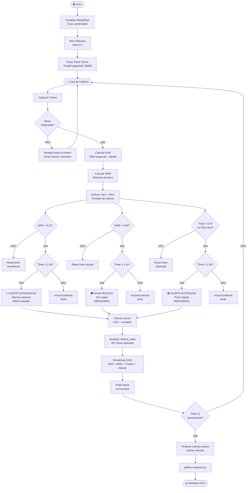
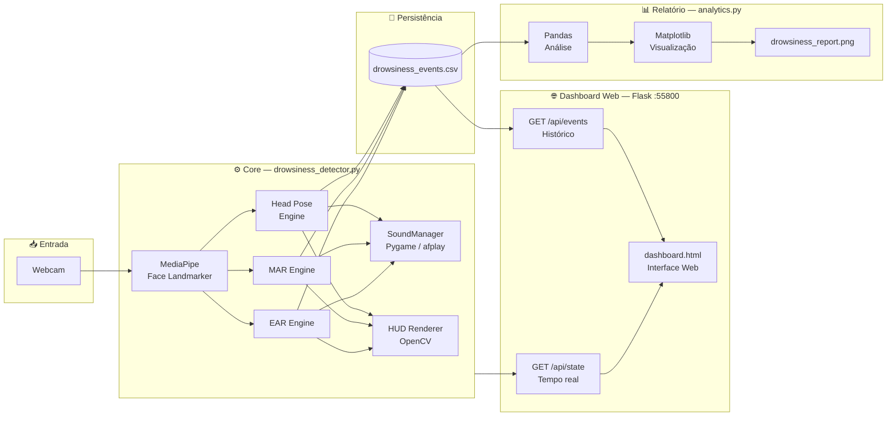

<div align="center">

# 👁️ Sleep Recognition System

### Sistema de Detecção de Sonolência e Distração em Tempo Real

[](https://python.org)
[](https://opencv.org)
[](https://mediapipe.dev)
[](https://flask.palletsprojects.com)
[](LICENSE)

> **Monitoramento facial inteligente** para prevenção de acidentes causados por fadiga e distração ao volante, usando visão computacional e análise biométrica em tempo real.

</div>

---

## 🎯 Visão Geral

Eu crie o  **Sleep Recognition System** para necessidade pessoal quando viajo de carro da sono. Solução completa de segurança viária que monitora continuamente o estado de atenção do motorista via webcam. Utilizando o modelo **MediaPipe Face Landmarker** (468 pontos faciais 3D), o sistema calcula métricas biométricas clínicas em cada frame e dispara alertas multimodais (visual + sonoro) antes que um acidente ocorra.

<a href="https://www.youtube.com/watch?v=u56r2gjhIU0" target="_blank">
  
</a>

<video src="video.mp4" width="700" height="600" style="object-fit: cover;" autoplay loop muted playsinline></video>

```
┌─────────────────────────────────────────────────────────────────┐
│                    PIPELINE DE DETECÇÃO                         │
│                                                                 │
│  Webcam  ──▶  MediaPipe  ──▶  EAR / MAR / Yaw / Pitch         │
│               (468 pts)        ▼         ▼         ▼           │
│                            Sonolência  Bocejo  Distração        │
│                                ▼         ▼         ▼           │
│                            Alarme    Aviso    Alerta + LOG      │
│                                ▼                                │
│                         CSV  ──▶  Dashboard Web  ──▶  Report   │
└─────────────────────────────────────────────────────────────────┘
```

---

## 🔬 Fundamentação Matemática

### Eye Aspect Ratio (EAR) — Detecção de Fechamento Ocular

Mede a abertura dos olhos comparando distâncias verticais e horizontais dos marcos faciais:

$$\text{EAR} = \frac{||p_2 - p_6|| + ||p_3 - p_5||}{2 \cdot ||p_1 - p_4||}$$

```
         p2    p3
    p1 ●──●────●──● p4
         p6    p5

EAR alto → olhos abertos → motorista atento
EAR < 0.22 por > 1.5s → ALERTA DE SONOLÊNCIA
```

### Mouth Aspect Ratio (MAR) — Detecção de Bocejos

Mede a abertura da boca usando pontos das comissuras e lábios:

$$\text{MAR} = \frac{||m_2 - m_8|| + ||m_3 - m_7|| + ||m_4 - m_6||}{2 \cdot ||m_1 - m_5||}$$

```
       m2  m3
  m1 ●──●──●──● m5
       m8  m6
         m7 m4

MAR > 0.60 por > 1.5s → BOCEJO / FADIGA ACUMULADA
```

### Head Pose Estimation — Detecção de Distração

Estima rotação horizontal (Yaw) e vertical (Pitch) sem gimbal via razão de distâncias:

```
Yaw  = (d_nariz→olho_dir - d_nariz→olho_esq) / (soma total)
Pitch = (d_nariz→testa - d_queixo→nariz)   / (soma total)

|Yaw| > 0.33  → Cabeça virada lateralmente
Pitch > 0.12  → Cabeça baixa (celular)
Pitch < -0.38 → Cabeça erguida demais
```

---

## 🗺️ Fluxograma do Sistema



---

## 🏗️ Arquitetura dos Componentes



---

## 📊 Dashboard Analítico

Ao final de cada sessão, o comando `python analytics.py` gera um relatório visual completo em `drowsiness_report.png`:

```
┌─────────────────────────────────────────────────────────────────────┐
│          DASHBOARD DE ANÁLISE DE FADIGA E DISTRAÇÃO                │
├───────────────────────────┬─────────────────────────────────────────┤
│  📊 MÉTRICAS DA SESSÃO    │   Contagem por Tipo de Evento          │
│                           │                                         │
│  Total Eventos: 10        │   ████ Sonolência  4                   │
│  Sonolências:   4         │   ███  Bocejos     4  ← barras          │
│  Bocejos:       4         │   ██   Distração   2     coloridas      │
│  Distrações:    2         │                                         │
│  Tempo Risco: 14.3s       │                                         │
│  Status: ⚠️  ATENÇÃO      │                                         │
├───────────────────────────┴─────────────────────────────────────────┤
│  Linha do Tempo e Duração dos Alertas                               │
│                                                                     │
│  4.5s ┤                                               ●  Sonolência │
│  3.5s ┤               ●                      ●     ●  ◆  Bocejo    │
│  2.5s ┤ ◆    ◆              ◆                         ▲  Distração │
│  1.5s ┤      ▲   ●     ▲                              │             │
│       └──────────────────────────────────────────────▶ Tempo       │
│          T+5  T+8  T+10 T+14  T+22  T+25  T+28  T+37 T+42 min     │
├─────────────────────────────────────────────────────────────────────┤
│  Progressão de Severidade ao Longo da Sessão                       │
│                                                                     │
│  4.5s ┤                              ╔══════════════════════════    │
│  3.0s ┤           ╔═════════════════╝  ← pico acumulado            │
│  1.5s ┤ ╔═════════╝  ▌  ▌  ▌  ▌  ▌  ▌  ▌  ← eventos individuais   │
│       └──────────────────────────────────────────────▶ Tempo       │
└─────────────────────────────────────────────────────────────────────┘
```

**Classificação de Risco Automática:**

| Status | Condição | Cor |
|:---:|:---|:---:|
| ✅ **SEGURO** | < 2 alertas, tempo de risco < 10s | Verde |
| ⚠️ **ATENÇÃO** | > 1 drowsy/distração ou > 3 bocejos | Âmbar |
| 🚨 **CRÍTICO** | ≥ 4 alertas ou tempo de risco > 15s | Vermelho |

---

## 🖥️ HUD em Tempo Real (Glassmorphism)

```
┌─────────────────────────────────────────────────────────┐ ← Frame OpenCV
│ EAR (Olhos)  0.31  [██████████░░░│░░░░░]                │
│ MAR (Boca)   0.18  [████░░░░░░░░░│░░░░░]  DASHBOARD    │
│                                           Sonolências: 2 │
│  TRACKER     ╔═══════╗    YAW: +0.12     Bocejos:    1  │
│  CABEÇA      ║   ●   ║    PIT: +0.04     Distrações: 0  │
│              ╚═══════╝                   Status: ATENTO  │
│                                                          │
│          [ FEED DA CÂMERA EM TEMPO REAL ]               │
│                                                          │
│                                                          │
├══════════════════════════════════════════════════════════╡ ← Alerta
│ 🔴 ALERTA DE SONOLÊNCIA! FAÇA UMA PAUSA!         2.3s  │
└─────────────────────────────────────────────────────────┘
```

**Componentes do HUD:**

| Componente | Descrição |
|:---|:---|
| **Barra EAR** | Nível de abertura ocular com marcador de threshold |
| **Barra MAR** | Nível de abertura da boca com marcador de threshold |
| **Head Tracker** | Bolinha que se move conforme Yaw/Pitch da cabeça |
| **Sidebar** | Contadores de sessão em tempo real |
| **Faixa de Alerta** | Banner colorido pulsante na base da tela |

---

## 🔊 Sistema de Áudio

Três alertas sonoros distintos gerados por síntese de onda senoidal pura (sem dependências externas):

```
alarm.wav            → 900 Hz pulsado (0.12s on / 0.13s off) — Sonolência
yawn_warning.wav     → 480 Hz / 640 Hz alternado             — Bocejo
distraction_warning.wav → 650 Hz / 850 Hz pulso rápido       — Distração
```

Backend de áudio com fallback automático:
```
pygame.mixer disponível? ──SIM──▶ Pygame (multi-canal simultâneo)
                          ──NÃO──▶ macOS afplay (subprocess nativo)
                                   ou alertas apenas visuais
```

---

## 🛠️ Stack Tecnológica

```
┌──────────────────────────────────────────────────────────┐
│                    TECNOLOGIAS USADAS                    │
├─────────────────┬────────────────────────────────────────┤
│ Visão Computac. │ OpenCV 4.x + MediaPipe Face Landmarker │
│ Análise Facial  │ 468 pontos 3D · EAR · MAR · Head Pose  │
│ Backend Web     │ Flask (thread daemon) · REST JSON API   │
│ Análise de Dados│ Pandas · Matplotlib (dark theme 300dpi) │
│ Áudio           │ Pygame Mixer · afplay (macOS fallback)  │
│ Logging         │ CSV estruturado com timestamp ISO 8601  │
└─────────────────┴────────────────────────────────────────┘
```

---

## 🚀 Instalação e Execução

### 1. Clonar e preparar ambiente

```bash
git clone https://github.com/wellson/Sleep_Recognition_System.git
cd Sleep_Recognition_System

python3 -m venv .venv
source .venv/bin/activate          # macOS / Linux
# .venv\Scripts\activate           # Windows

pip install -r requirements.txt
```

### 2. Gerar arquivos de áudio

```bash
python generate_audio.py
# Cria: assets/alarm.wav · assets/yawn_warning.wav · assets/distraction_warning.wav
```

### 3. Iniciar o monitoramento

```bash
python drowsiness_detector.py
```

- Dashboard Web em tempo real: **http://localhost:55800**
- Pressione **`q`** para encerrar com segurança

### 4. Gerar relatório analítico

```bash
python analytics.py
# Exporta: drowsiness_report.png (300 DPI, dark theme)
```

### Modo menu interativo (macOS/Linux)

```bash
chmod +x run.sh && ./run.sh
```

---

## 📁 Estrutura do Projeto

```
Sleep_Recognition_System/
├── drowsiness_detector.py    # Core: detecção, HUD, Flask API
├── analytics.py              # Geração de relatório Matplotlib
├── generate_audio.py         # Síntese de alarmes WAV
├── dashboard.html            # Interface web em tempo real
├── face_landmarker.task      # Modelo MediaPipe (pré-compilado)
├── run.sh                    # Menu interativo CLI
├── requirements.txt          # Dependências Python
├── drowsiness_events.csv     # Log de eventos da sessão
├── drowsiness_report.png     # Relatório gerado
└── assets/
    ├── alarm.wav             # Alarme de sonolência
    ├── yawn_warning.wav      # Aviso de bocejo
    └── distraction_warning.wav # Alarme de distração
```

---

## 📋 Estrutura do Log CSV

```
drowsiness_events.csv
```

| Timestamp | Event_Type | Duration_Seconds | Peak_Value |
|:---|:---:|:---:|:---:|
| `2026-05-19 20:15:10` | `YAWN` | `1.85` | `0.725` |
| `2026-05-19 20:22:40` | `DROWSINESS` | `2.40` | `0.142` |
| `2026-05-19 20:31:05` | `DISTRACTION` | `3.20` | `0.650` |

**Event_Type:** `DROWSINESS` · `YAWN` · `DISTRACTION`
**Peak_Value:** EAR mínimo (drowsiness) · MAR máximo (yawn) · desvio máximo (distraction)

---

## ⚙️ Parâmetros de Configuração

| Parâmetro | Valor Padrão | Descrição |
|:---|:---:|:---|
| `EAR_THRESHOLD` | `0.22` | Limiar de fechamento ocular |
| `MAR_THRESHOLD` | `0.60` | Limiar de abertura da boca |
| `ALERT_DURATION` | `1.5s` | Tempo mínimo para disparar alerta |
| `YAW_THRESHOLD` | `0.33` | Rotação lateral máxima |
| `PITCH_DOWN_THRESHOLD` | `0.12` | Inclinação frontal máxima |
| `PITCH_UP_THRESHOLD` | `-0.38` | Inclinação traseira máxima |
| Flask Port | `55800` | Porta do dashboard web |

---

## 🌐 API REST (Dashboard em Tempo Real)

| Endpoint | Método | Descrição |
|:---|:---:|:---|
| `/` | GET | Serve o `dashboard.html` |
| `/api/state` | GET | Estado atual em JSON (EAR, MAR, alertas) |
| `/api/events` | GET | Histórico completo do CSV em JSON |

**Exemplo de resposta `/api/state`:**
```json
{
  "ear": 0.31,
  "mar": 0.18,
  "yaw": 0.05,
  "pitch": 0.02,
  "is_drowsy": false,
  "is_yawn": false,
  "is_distracted": false,
  "drowsy_count": 1,
  "yawn_count": 2,
  "distracted_count": 0,
  "status": "ATENTO"
}
```

---

<div align="center">

**Desenvolvido com foco em segurança viária e prevenção de acidentes por fadiga.**

*Visão Computacional · Biometria Facial · Análise em Tempo Real*

</div>
